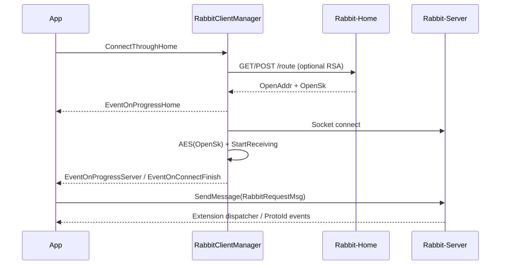

# RabbitClient-CSharp

[](https://docs.microsoft.com/en-us/dotnet/standard/net-standard)
[](https://docs.microsoft.com/en-us/dotnet/csharp/)
[](https://github.com/xuzhuoxi/RabbitClient-CSharp/actions/workflows/CI.yml)
[](https://codecov.io/gh/xuzhuoxi/RabbitClient-CSharp)
[](LICENSE)

[简体中文](README.md) | English

A .NET Standard 2.0 client library: discover Rabbit-Server instances via Rabbit-Home, then connect over sockets and exchange encrypted messages. It depends on the sibling repo [Infra-CSharp](https://github.com/xuzhuoxi/Infra-CSharp).

## Table of contents

- [Overview](#overview)
- [Notes](#notes)
- [Features](#features)
- [Technology stack](#technology-stack)
- [Layout](#layout)
- [Installation](#installation)
- [Quick start](#quick-start)
- [Connection flow](#connection-flow)
- [Modules](#modules)
- [Events](#events)
- [API docs](#api-docs)
- [Building and testing](#building-and-testing)
- [Releasing](#releasing)
- [License](#license)

## Overview

RabbitClient-CSharp is for clients that must discover backends at runtime: query Rabbit-Home for a route, then connect to that Rabbit-Server. The entry point is `JLGames.RabbitClient.RabbitClientManager`, which coordinates Home queries, socket I/O, AES session encryption, and event dispatch.

The library targets **.NET Standard 2.0** (C# 7.3) and runs on Windows, macOS, and Linux. Tests target **net8.0**.

Releases are Debug / Release DLL zips on GitHub; NuGet packing is not enabled yet. Latest notes live under [`notes/release/`](notes/release/).

## Notes

- **Pin Infra-CSharp for releases.** For source builds, keep this repo next to [Infra-CSharp](https://github.com/xuzhuoxi/Infra-CSharp) under the same parent (`JLGameStudios/Infra-CSharp` and `JLGameStudios/RabbitClient-CSharp`). **CI** reads `Require.yml` `Default.Infra-CSharp`. **Release** finds the `Require` item whose `Tag` equals this repo’s tag and uses that item’s `Infra-CSharp`. Both fields share the same format: a branch name is the tip of that branch, `v*.*.*` is a tag, otherwise a git short SHA. Missing entries abort the workflow; they do not fall back to `Default`.
- **Use a matching Rabbit-Home / Rabbit-Server version.** Route queries, framing, and session keys evolve with the protocol; mixing versions can fail handshake or parsing.
- Tests that need a local Rabbit-Home (default HTTP `127.0.0.1:9000`) and Rabbit-Server are marked `RunOnlyThis` and are skipped in CI.
- Public API is defined by the source. Socket callbacks use `SynchronizationContext`. `RabbitClientManager` implements `IDisposable` and should be disposed.

## Features

- **Home discovery**: `RabbitHomeClient` queries Rabbit-Home `/route` for an available server (GET/POST, query key `q`; optional RSA encryption of query params; default timeout 100 seconds).
- **Manager**: `RabbitClientManager.ConnectThroughHome` queries, connects, applies the AES session key, and starts receiving.
- **Sockets**: `RabbitSocketServer` / `RabbitSocketClient` for connect, send/receive, and `GetExtensionDispatcher` by Extension name.
- **Messages**: request/response types under `JLGames.RabbitClient.Server.Message` (`RabbitRequestMsg` / `RabbitResponseMsg`); little-endian by default.
- **Session crypto**: optional 32-byte temp AES key on the query; Home’s `OpenSk` is used for later socket AES. Optional RSA (PEM or PKCS#1) on the query.
- **Events**: Home/Server progress, connect finished, send/receive, MMO room/player/unit events.
- **MMO**: Player / Room / Unit entities, `IVarSet`, Meta, and events.
- **Threading**: `SetThreadSocketContext(SynchronizationContext)` to marshal socket callbacks.

## Technology stack

- **.NET Standard 2.0** / **C# 7.3+** (tests: C# 10 / net8.0)
- **NUnit 3** + **coverlet**
- **Infra-CSharp** as a sibling `ProjectReference` (net, events, crypto). No other required NuGet packages on the library
- **dotnet CLI**
- **GitHub Actions**: CI, Release, ReleaseNote

## Layout

```
RabbitClient-CSharp/
├── RabbitClient/                 # Library (netstandard2.0)
│   └── JLGames/RabbitClient/
│       ├── Home/                 # Home query, keys, route results
│       ├── Server/
│       │   ├── Message/          # Request / response I/O
│       │   └── MMO/              # Entities, vars, Meta, events
│       ├── RabbitClientManager.cs
│       └── RabbitClientManagerEvents.cs
├── RabbitClient-Test/            # Tests (net8.0)
│   ├── Home/ / Server/ / MMO/    # No local services
│   ├── Rabbit/                   # Integration (Category=RunOnlyThis)
│   └── Resources/                # Test PEMs
├── RabbitClient-API/             # Bilingual API docs
├── notes/release/                # Release-note template and per-tag notes
├── Require.yml                   # CI default Infra version; Release tag map
├── .github/
│   ├── workflows/                # CI / Release / ReleaseNote
│   └── scripts/                  # resolve-infra-ref.py
└── RabbitClient-CSharp.sln
```

The solution also references `../Infra-CSharp/Infra-CSharp/Infra-CSharp.csproj`.

## Installation

### Prerequisites

- A runtime compatible with .NET Standard 2.0
- .NET 8 SDK to build and test from source; local Rabbit-Home / Rabbit-Server for integration tests

### DLL from GitHub Release

From [GitHub Releases](https://github.com/xuzhuoxi/RabbitClient-CSharp/releases), download the zip for the target tag (`RabbitClient-CSharp_<tag>_release_netstandard2.0.zip` or `..._debug_...`) and reference `RabbitClient.dll`. The archive also includes `Infra-CSharp.dll`, `.pdb`, `.deps.json`, `LICENSE`, `README.md`, and `README_EN.md`. The same Release also publishes `SHA256SUMS.txt`.

### Build from source

```bash
git clone https://github.com/xuzhuoxi/RabbitClient-CSharp.git
git clone https://github.com/xuzhuoxi/Infra-CSharp.git
# Both repos must sit under the same parent directory
cd RabbitClient-CSharp
dotnet build RabbitClient-CSharp.sln --configuration Release
```

Check out the Infra tag that `Require.yml` maps for this repo’s version. For example, this repo’s `v1.2.1` maps to Infra `v1.4.1`.

## Quick start

```csharp
using System.Threading;
using System.Threading.Tasks;
using JLGames.Infra.Net;
using JLGames.RabbitClient;
using JLGames.RabbitClient.Home;
using JLGames.RabbitClient.Server.Message;

var homeUrl = "http://127.0.0.1:9000";
var httpProxy = new HttpClientProxy(homeUrl);
var manager = new RabbitClientManager(
    httpProxy,
    homeUrl,
    usePost: false,
    enableKey: true,
    isPemKey: true,
    pubKeyPath: "x509_public.pem",
    pubKeyContent: null);

manager.SetThreadSocketContext(SynchronizationContext.Current);
manager.AddEventListener(RabbitClientManagerEvents.EventOnProgressHome, evd =>
{
    // ProgressEventData<QueryResult>
});
manager.AddEventListener(RabbitClientManagerEvents.EventOnConnectFinish, evd =>
{
    var ok = (bool)evd.Data;
    if (!ok) return;

    manager.SocketClient.GetExtensionDispatcher("Mmo")
        .AddEventListener("PER", e => { /* RabbitResponseMsg */ });

    var req = new RabbitRequestMsg();
    req.SetClientId("cid");
    req.SetProtoInfo("Mmo", "PER");
    req.StartWriteData();
    req.WriteRequestBase("hello");
    manager.SocketClient.SendMessage(req);
});

await manager.ConnectThroughHome("main01", "Rabbit-Server", randomAesKey: true);
```

When `randomAesKey` is `true`, a 32-byte temp AES key is derived from the passphrase `RabbitClient` by default. You can also pass a `byte[]` or a full `QueryRouteInfo`. Alternatively, construct the manager from `HomeSettings`, or use `RabbitHomeClient` alone and then build `RabbitSocketServer` / `RabbitSocketClient` yourself.

## Connection flow



1. Serialize `QueryRouteInfo` (`pid`, `type-name`, optional `temp-key`) to JSON, optionally RSA-encrypt it, Base64-encode it, and send it as `q` to Home `/route`.
2. Home returns instance address `OpenAddr`, protocol `OpenNetwork`, and session key `OpenSk` (decrypted first if the request included a 32-byte temp key).
3. `RabbitSocketServer` connects to that address; on success it applies AES from `OpenSk` and starts receiving.
4. Outbound traffic uses `RabbitRequestMsg`. Inbound messages are dispatched by header Extension to an `IEventDispatcher`, with the event name equal to `ProtoId`.

## Modules

| Namespace | Role |
| --- | --- |
| `JLGames.RabbitClient` | `RabbitClientManager`: query, connect, session crypto, progress events |
| `JLGames.RabbitClient.Home` | Home URL/key settings, route query, results |
| `JLGames.RabbitClient.Server` | Socket connect/send/receive and connection events |
| `JLGames.RabbitClient.Server.Message` | Headers, request/response readers and writers |
| `JLGames.RabbitClient.Server.MMO` | Entities, vars, Meta, MMO events |

## Events

| Source | Event | Payload |
| --- | --- | --- |
| `RabbitClientManagerEvents` | `EventOnProgressHome` | `ProgressEventData<QueryResult>` |
| `RabbitClientManagerEvents` | `EventOnProgressServer` | `ProgressEventData<SocketConnEventInfo>` |
| `RabbitClientManagerEvents` | `EventOnConnectFinish` | `bool` |
| `RabbitSocketClientEvents` | `EventOnClientSendMessagePrepare` / `EventOnClientSendMessage` | `MessageContent` |
| `RabbitSocketClientEvents` | `EventOnClientReceiveMessage` | `IRabbitResponseMsg` |
| `RabbitSocketClientEvents` | `EventOnClientReceiveMessageFailed` | `FailedInfo` |
| `RabbitSocketServerEvents` | `EventOnConnectionOpenSuc` / `Fail` / `Close` | Connection info |
| `RabbitSocketClient.GetExtensionDispatcher` | Header `ProtoId` | `RabbitResponseMsg` |

## API docs

- **[API overview](RabbitClient-API/en/README.md)**
- **[Home](RabbitClient-API/en/JLGames.RabbitClient.Home.md)**
- **[Server](RabbitClient-API/en/JLGames.RabbitClient.Server.md)**
- **[Message](RabbitClient-API/en/JLGames.RabbitClient.Server.Message.md)**
- **[MMO](RabbitClient-API/en/JLGames.RabbitClient.Server.MMO.md)**
- **[RabbitClient](RabbitClient-API/en/JLGames.RabbitClient.md)** (manager)

Chinese API docs: [README.md](README.md).

CI is documented in [CI.md](.github/workflows/CI.md). Release tagging is documented in [Release.md](.github/workflows/Release.md). Updating notes on an existing release is documented in [ReleaseNote.md](.github/workflows/ReleaseNote.md). Per-tag notes live at `notes/release/ReleaseNotes_<tag>.md`. Root `CHANGELOG.md` is historical and no longer appended.

## Building and testing

```bash
# Infra-CSharp must sit next to this repo
dotnet build RabbitClient-CSharp.sln --configuration Release

# All tests (need local Rabbit-Home on HTTP 9000 / Rabbit-Server)
dotnet test RabbitClient-Test/RabbitClient-Test.csproj

# Same as CI: skip tests that need a local server
dotnet test RabbitClient-Test/RabbitClient-Test.csproj --filter "Category!=RunOnlyThis"

# Collect coverage (same as CI)
dotnet test RabbitClient-Test/RabbitClient-Test.csproj \
  --filter "Category!=RunOnlyThis" \
  --collect:"XPlat Code Coverage"
```

- **Debug**: `RabbitClient/bin/Debug/netstandard2.0/`
- **Release**: `RabbitClient/bin/Release/netstandard2.0/`

Pushes and pull requests to `master`, or a manual **Run workflow** in Actions, run CI (`.github/workflows/CI.yml`). CI reads `Require.yml` `Default.Infra-CSharp` to choose the Infra version, skips `RunOnlyThis`, and uploads cobertura reports to Codecov when present.

## Releasing

Pushing a `v*.*.*` tag whose commit is on `master` runs Release, which:

1. Looks up that tag in `Require.yml` (aborts if missing)
2. Checks out the mapped Infra-CSharp ref
3. Builds Debug / Release `netstandard2.0` DLL zips, writes `SHA256SUMS.txt`, and creates a GitHub Release

A tag that contains `-` (for example `v1.2.1-rc.1`) is marked prerelease. If notes change after the tag is pushed, the ReleaseNote workflow can update an existing Release body only.

`Require.yml` example:

```yaml
Default:
  Infra-CSharp: v1.4.1   # branch | v*.*.* | commit SHA
Require:
  - Tag: v1.2.1
    Infra-CSharp: v1.4.1   # same format as Default
```

## License

The scripts and documentation in this project are released under the [MIT](LICENSE) License.
